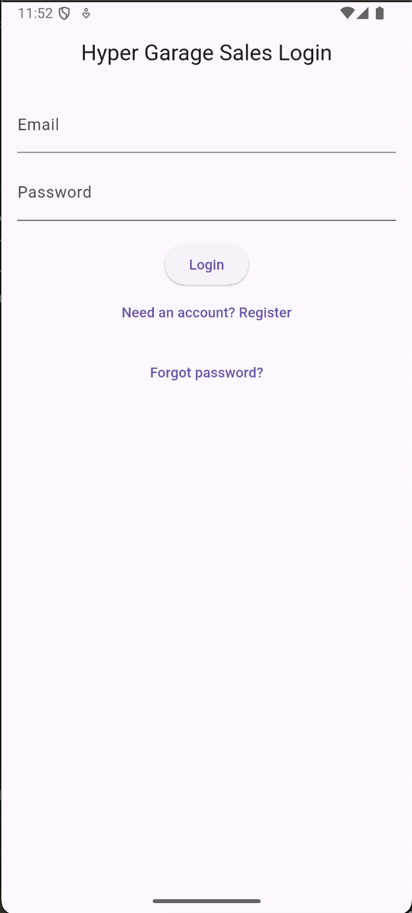
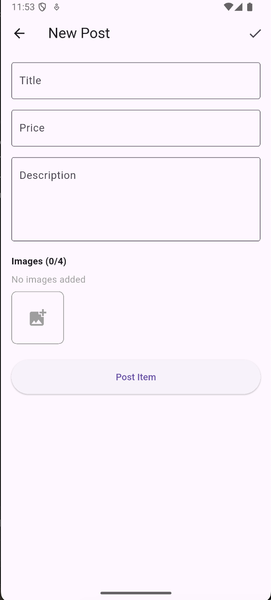
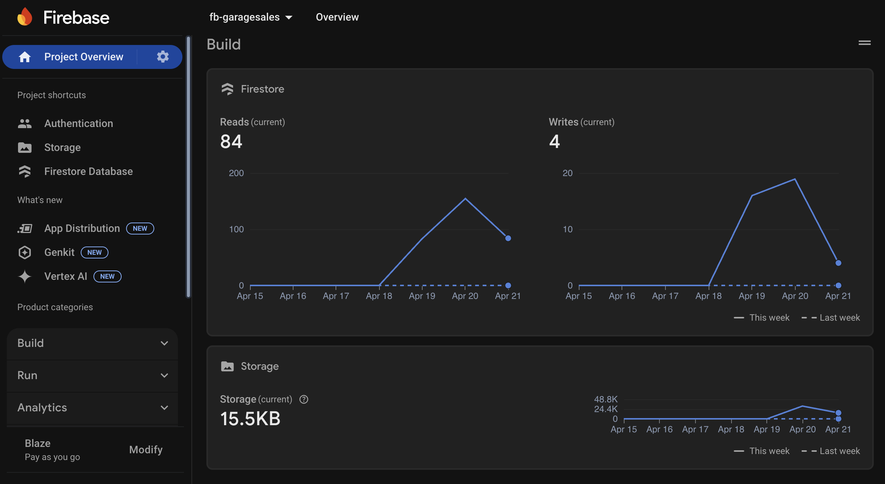

# HyperGarageSale

&#x20;&#x20;

A **Flutter** mobile marketplace app for buying and selling items locally. HyperGarageSale leverages **Firebase** for authentication, real-time Firestore data, and secure image storage.

---

## 📋 Table of Contents

- [Features](#-features)
- [Demo](#-demo)
- [Screenshots](#-screenshots)
- [Getting Started](#-getting-started)
  - [Prerequisites](#prerequisites)
- [Project Structure](#-project-structure)
- [Contributing](#-contributing)
- [License](#-license)

---

## ✨ Features

- **User Authentication**: Email/password registration, login, password reset via Firebase Auth.
- **Post Creation**: Add title, description, integer price, and up to 4 images (camera or gallery).
- **SnackBar**: Add SnackBar that comes up when a new post has been added.
- **Real-time Listings**: Browse posts sorted by creation time with pull-to-refresh or live updates (StreamBuilder).
- **Detail View**: Display full post details and image thumbnails; tap thumbnails to view full-screen with hero animations.
- **Image Storage**: Upload images to Firebase Storage with metadata and caching.
- **Responsive UI**: Card-based layout with large thumbnails and consistent Material 3 styling.

## 🎬 Demo
[](https://www.youtube.com/watch?v=99LJogoK6dQ)


## 📸 Screenshots

<p align="center">
  
  
  
  
</p>

## 🚀 Getting Started

### Prerequisites

- [Flutter SDK](https://flutter.dev/docs/get-started/install)
- [Dart SDK](https://dart.dev/get-dart)
- A Firebase project with **Authentication**, **Cloud Firestore**, and **Storage** enabled.


## 📁 Project Structure

```text
lib/
 ├── screens/
 │   ├── browse_posts_screen.dart
 │   ├── new_post_screen.dart
 │   ├── post_detail_screen.dart
 │   └── full_screen_image.dart
 ├── models/
 │   └── post.dart
 └── main.dart
android/
ios/
pubspec.yaml
README.md
screenshots/  
LICENSE
```

## 🤝 Contributing

Contributions are welcome! Please open an issue to discuss your ideas or submit a pull request.

1. Fork the repo.
2. Create a new branch (`git checkout -b feature/YourFeature`).
3. Commit your changes (`git commit -m 'Add feature'`).
4. Push to the branch (`git push origin feature/YourFeature`).
5. Open a Pull Request.

## 📜 License

This project is licensed under the MIT License - see the [LICENSE](LICENSE) file for details.

